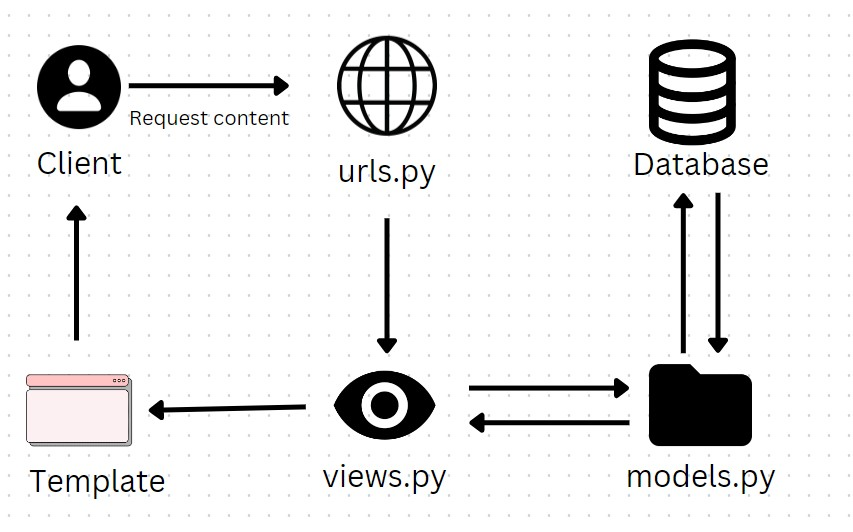

# Tugas 2: Pengenalan Aplikasi Django dan Models View Template (MVT) pada Django

Pemrograman Berbasis Platform (CSGE602022) - diselenggarakan oleh Fakultas Ilmu Komputer Universitas Indonesia, Semester
Ganjil 2022/2023

## Nama: Syahrul Apriansyah

## NPM : 2106708311

## link deploy: https://tugas-pbp-syahrul.herokuapp.com/katalog/

### Buatlah bagan yang berisi request client ke web aplikasi berbasis Django beserta responnya dan jelaskan pada bagan tersebut kaitan antara `urls.py`, `views.py`, `models.py`, dan berkas html;

)

<b>Penjelasan:</b>

Pertama-tama, user yang berperan sebagai client-side akan melakukan request berupa URL path. Lalu, Django sebagai server-side akan mencari kecocokan request user dengan URL patterns yang ada di `urls.py` (dalam kasus ini adalah `katalog.urls`). Request yang bersesuaian tersebut kemudian diteruskan ke `views.py` (`katalog.views`) yang berfungsi sebagai controller untuk merender webpage dari data yang tersedia. Untuk melakukan hal ini, `views.py` akan berinteraksi dengan models.py untuk mendapatkan data dari database yang kemudian dirender menjadi file HTML menggunakan template terkait yang telah tersedia di folder templates. Terakhir, user akan menerima response hasil render file HTML tersebut.

### Jelaskan kenapa menggunakan virtual environment? Apakah kita tetap dapat membuat aplikasi web berbasis Django tanpa menggunakan virtual environment?

Virtual environment adalah sebuah environment yang terisolasi dari dependencies utama. Dengan begitu, setiap environment dapat memiliki dependecies yang sesuai dengan kriterianya masing-masing tanpa harus tercampur dengan dependecies dari environment yang lain. Penggunaan virtual environment bersifat unlimited sehingga kita dapat membuat membuat banyak venv untuk banyak project yang berbeda-beda. Tools ini juga banyak digunakan di Python yaitu di Django, untuk mengeksekusi suatu aplikasi yang dibuat.

Saat kita menginstall suatu library tanpa menggunakan virtual env, maka secara default library tersebut akan terinstall secara global pada python dan semua aplikasi bisa mengaksesnya. Namun, biasanya antar aplikasi membutuhkan dan cocok dengan library atau versi library yang berbeda-beda. Jika diinstall secara global, ketika library tersebut diupgrade ke versi terbaru, lalu terdapat aplikasi A yang kita buat tidak kompatibel dengan versi terbaru library tersebut. Tentunya aplikasi A menjadi tidak bisa berjalan dengan baik. Sementara itu, terdapat aplikasi B yang membutuhkan library versi terbaru tersebut untuk berjalan.

### Jelaskan bagaimana cara kamu mengimplementasikan poin 1 sampai dengan 4 di atas.

<ol>
    <li>Melakukan loaddata json ke dalam database django</li>
    <li>Load data ke dalam models</li>
    <li>Models diproses melalui views untuk dikirim ke template </li>
    <li>User akan membuka web sesuai route yang telah di atur oleh urls.py</li>
</ol>

