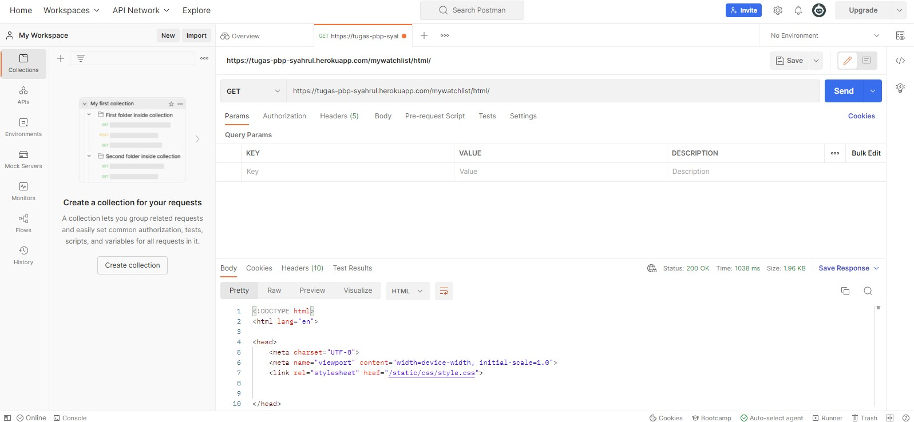
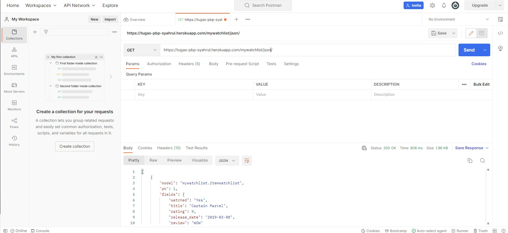
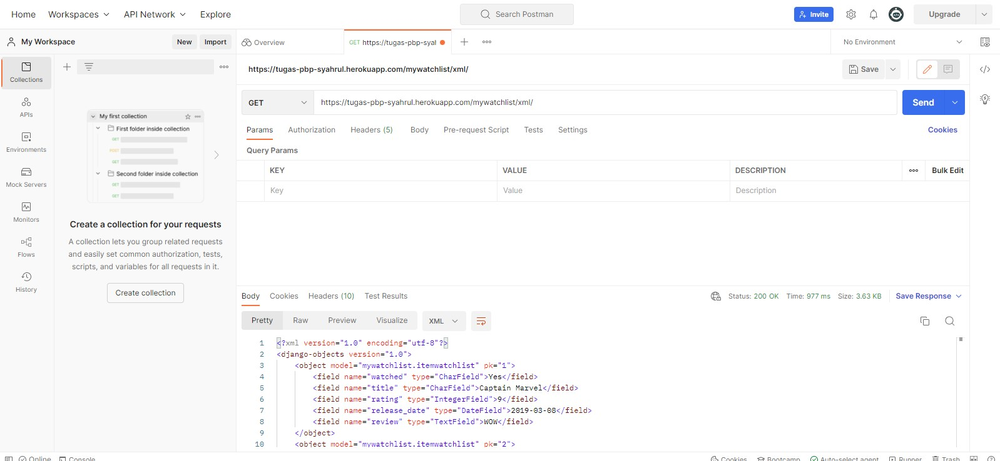

# Tugas 3: Pengimplementasian Data Delivery Menggunakan Django

Pemrograman Berbasis Platform (CSGE602022) - diselenggarakan oleh Fakultas Ilmu Komputer Universitas Indonesia, Semester
Ganjil 2022/2023

## Nama: Syahrul Apriansyah

## NPM : 2106708311

### Jelaskan perbedaan antara JSON, XML, dan HTML!

<b>Penjelasan:</b>

`JSON` (`JavaScript Object Notation`) adalah format pertukaran data yang ringan dan sepenuhnya tidak bergantung pada bahasa. `JSON` didasarkan pada bahasa pemrograman `JavaScript`.

`XML` (`Extensible markup language`) dirancang untuk membawa data, bukan untuk menampilkan data. `Extensible Markup Language` (`XML`) adalah bahasa markup yang mendefinisikan seperangkat aturan untuk menyandikan dokumen dalam format yang dapat dibaca manusia dan dapat dibaca mesin. Tujuan desain `XML` fokus pada kesederhanaan, umum, dan kegunaan di Internet. `XML` adalah format data tekstual dengan dukungan kuat melalui Unicode untuk bahasa manusia yang berbeda. Meskipun desain `XML` berfokus pada dokumen, `XML` banyak digunakan untuk representasi struktur data arbitrer seperti yang digunakan dalam layanan web. 

`HTML` adalah bahasa hypertext markup. `HTML` digunakan untuk menampilkan isi di computer `user`/`client` (browser). Tidak seperti `JSON` dan `XML`, `HTML` bukan digunakan untuk transfer data mentah. `HTML` digunakan untuk menampilkan data yang dapat langsung diterima oleh user.

### Jelaskan mengapa kita memerlukan data delivery dalam pengimplementasian sebuah platform?

Karena sebuah platform digunakan untuk memberikan data, maka data delivery sangat penting dalam pengimplementasian sebuah platform. Data delivery adalah proses pengiriman data dari server ke client. Data delivery dapat dilakukan dengan menggunakan `JSON`, `XML`, dan `HTML`. `JSON` dan `XML` digunakan untuk transfer data mentah, sedangkan `HTML` digunakan untuk menampilkan data yang dapat langsung diterima oleh user.

### Jelaskan bagaimana cara kamu mengimplementasikan checklist di atas!

<ol>
<li>membuat app dengan startapp mywatchlist.</li>
<li>menambahkan path di urls.py proyek</li>
<li>membuat models di models.py mywatchlist</li>
<li>menyajikan xml, json, dan html dengan membuat fungsi di views.py mywatchlist</li>
<li>membuat routing di urls.py app</li>

</ol>

<h3> POSTMAN </h3>

)
)
)
